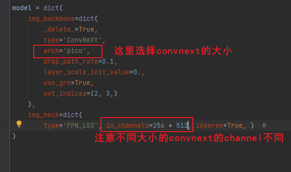
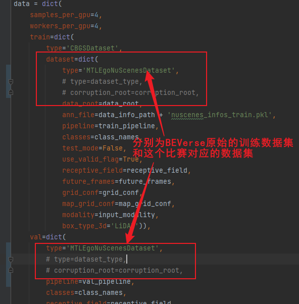
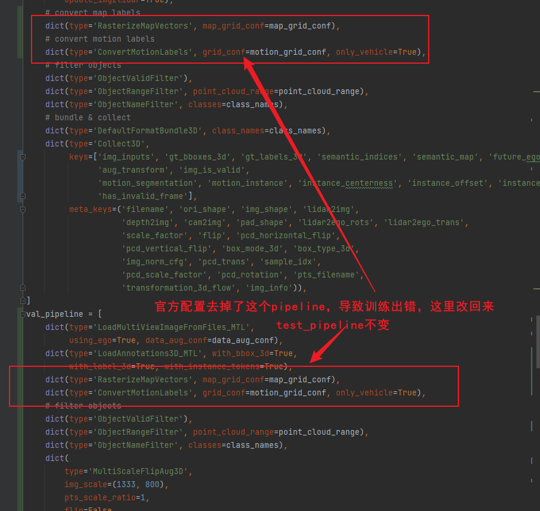
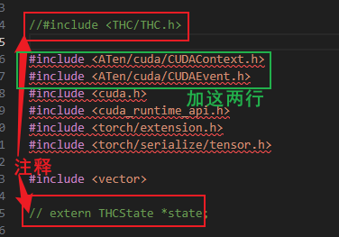

```shell
bash tools/dist_train.sh configs/robodrive/beverse_convnext_v2.py ${num_gpus}
```


**配置ConvNext**

文件位置：projects/configs/robodrive/beverse_convnext_v2.py

根据显存适当选择ConvNext的大小



**训练数据集配置**

BEVerse原始的datasets是MTLEgoNuScenesDataset，训练数据是原始的nusences

这个比赛的datasets是RobodriveDataset，这个dataset可以读取官方数据集，暂时不清楚官方数据集是不是nuscenes的子集。

**可以先用MTLEgoNuScenesDataset在nuscenes上训练，然后再用RobodriveDataset微调**，具体训练策略需要测试。

同时，目前评测模型是使用BEVerse提供的权重，也可以试试不改backbone，**先用RobodriveDataset对权重进行微调**。

手动打开注释就可以切换成RobodriveDataset。



**pipeline修复**

官方提供的配置文件中去除了下图所示数据转换，会导致训练出错，这里给加了回来，test_pipeline保持不变用于评测。



**FB结构运训环境**

FB结构新增了bevformer组件，需要将mmcv升级到>=1.5.2。解决方法如下两种：

1. 升级mmcv==1.5.2 mmdet==2.24.0 mmseg==0.24.0。然后手动将mmdet3d/\_\_init\_\_.py的mmcv_maximum_version修改为大于1.5.2的值。  
2. 将已安装的1.5.2版本的mmcv中的_ext.cpython-38-x86_64-linux-gnu.so库文件和ops文件夹拷贝到当前mmcv的安装目录下

升级mmcv后会出现`KeyError: 'SparseConv2d is already registered in conv layer'`的错误，只需要将mmdet3d/ops/spconv/conv.py中所有的@CONV_LAYERS.register_module()替换成@CONV_LAYERS.register_module(force=True)即可

### DEBUG

关于torch版本，beverse工程推荐使用torch==1.10.2，但是在评测时发现torch1.10.2会报错，所以我升级成了1.13.0。但是！

1. mmcv在训练时会报错：MMDistributedDataParallel‘ object has no attribute ‘_sync_params‘，这是因为新版把\_sync\_params改成了\_sync\_buffers。在报错的位置手动改成\_sync\_buffers就行。参考[这里](https://blog.csdn.net/qq_33854260/article/details/129037203)

2. torch1.13.0放弃了THC.h文件，所以mmdet3d编译时会报错fatal error: THC/THC.h: No such file or directory，需要手动对mmdet3d里的ops源码做如下修改：

   